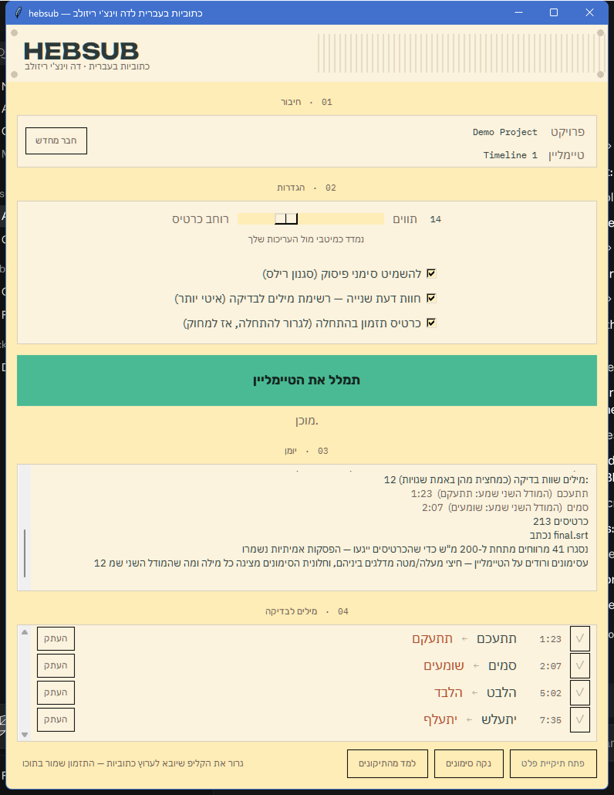
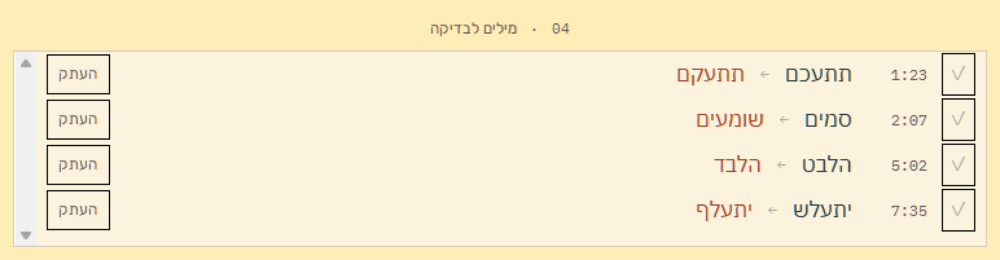

# HebSub

**Hebrew subtitles for DaVinci Resolve, in one button.** Open a timeline, press
one button, get a clean `.srt` in the master bin. Everything runs locally — no
cloud upload, no per-minute cost, no subscription.

DaVinci Resolve has no Hebrew in its auto-caption engine at all. The full
language list is Danish, Dutch, English, French, German, Italian, Japanese,
Korean, Mandarin, Norwegian, Portuguese, Russian, Spanish, Swedish. That
absence is why this exists.

This is **not** a transcription model. The ASR engine is a swappable commodity.
The product is everything that happens after the ASR: Hebrew-specific
correction, subtitle segmentation, and export that doesn't break RTL.

<p align="center">
  
</p>

---

## What it does

| Stage | What happens |
|---|---|
| Audio | Rendered from the timeline and fingerprinted. An unchanged timeline skips the render entirely |
| Transcribe | `ivrit-ai/whisper-large-v3-turbo-ct2`, locally, via faster-whisper |
| Proofread | Glossary substitution, a learned personal lexicon, optional second opinion |
| Segment | Cards cut to a measured width, without touching a single timestamp |
| Export | Valid UTF-8 `.srt`, imported to the master bin under a name you can find |

## Measured, not asserted

Every number here was measured on **29 hand-corrected reels across three
independent corpora**. The corpora themselves are client work and are not in
this repository.

| Metric | Result |
|---|---|
| Word accuracy | **95.3%** (4.69% WER) with the second opinion |
| Card boundary F1 | 65.1% / 66.9% / 55.2% by corpus |
| Automatic corrections | **6 words fixed, 0 broken** across all three corpora |
| Speed | ~60 s per 15-minute timeline; ~155 s with the second opinion |
| Cost per run | **Zero** — everything is local |
| Tests | 631 |

## The details that matter

**A timing card at zero.** Resolve **drops** the lead-in silence when it
imports an `.srt` — probed, and a clip whose first word was 2m44s in started at
zero instead. A placeholder card starting at `00:00:00,000` gives you something
to snap to the timeline start. Delete it, and everything after it lands
frame-exact.

**Cards that touch.** In hand-cut reference subtitles, 96.4% of cards touch the
next one and no gap under 60 ms ever appears. Ours used to leave 32% of gaps in
the 1–200 ms band. Now 95.9% touch, and real pauses are preserved.

**No card starts before its own speech.** Whisper's VAD pads 400 ms of room
tone before every utterance, which started the first card of each clip *before
the video existed*. Re-running the VAD unpadded fixes it. A card never begins
before its picture, or before the speech.

**Question marks survive.** In the reference set `?` appears 29 times across
4,331 words, and every other punctuation mark six times between them. Stripping
punctuation wholesale would delete the one mark that carries meaning in
short-form Hebrew.

**Artifacts scoped per project.** `work/<project>__<timeline>/`. Two clients
who both have a "Timeline 1" no longer overwrite each other.

**A second opinion that is deliberately not a better model.** It runs a second
ASR model that is *worse* on its own. The point is that it is **independently**
wrong: a word the two models disagree on is wrong 48.6% of the time, against
1.5% for a word they agree on. Where they disagree and exactly one produced a
real Hebrew word, that one is taken. Everything else is flagged, never silently
changed.

**Flagged words are reachable.** Every flagged word gets a timeline marker
(removed by `customData`, so your own markers survive) and a row in the panel.
Clicking a row moves Resolve's playhead to that word.

<p align="center">
  
</p>

## Install

### Windows — one download, one click

**[Download HebSub-4.0.0-Setup.exe](https://github.com/razraz213/hebsub-resolve/releases/latest)**  (178 MB)

Run it. That is the whole install. It brings its own Python and its own
ffmpeg, and it adds **HebSub** to Resolve's *Workflow › Scripts* menu for you.
Nothing needs to be on `PATH` and nothing needs administrator rights — it
installs per-user.

Then, once, in Resolve: **Preferences › System › General › External scripting
using → Local**. Resolve refuses all scripting until you do, and it is the one
step no installer can perform.

The speech model (~1.5 GB) downloads the first time you transcribe, into your
HuggingFace cache, where a reinstall reuses it.

If the panel does not open, **Start Menu › HebSub › HebSub — check
installation** writes a report to `%LOCALAPPDATA%\HebSub\selftest.txt` naming
the piece that failed.

Windows will show a blue "Windows protected your PC" notice, because the
installer is not code-signed yet — **More info › Run anyway**.

### From source — Windows, macOS, Linux

Requires Python 3.11+, `ffmpeg` on `PATH`, and DaVinci Resolve **Studio** —
scripting is not available in the free edition.

```bash
pip install -r requirements.txt
```

```bash
python -m hebsub.ui.app
```

That core set is **432 MB** and resolves on Windows, Linux and macOS. Three
optional add-ons, each in its own file, because between them they are 2.5 GB:

| File | Adds | Size | When |
|---|---|---|---|
| `requirements-gpu.txt` | CUDA for the ASR | ~2.0 GB | Windows/Linux **with an NVIDIA card**. These packages publish no macOS wheel at all |
| `requirements-llm.txt` | `torch`, for the masked-LM pass | 535 MB | Only for `--llm-adapter masked_lm`, which is off by default and measured at 0.12pp |
| `requirements-dev.txt` | `pytest`, `pysrt` | small | Running the test suite |

Without the GPU file the ASR runs on CPU — slower, and correct. Verified from
an empty virtualenv: core alone imports every module and passes 630 tests.

Or from Resolve: **Workflow › Scripts › hebsub**.

Enable scripting first, under **Preferences › System › General › External
scripting using › Local**.

## Workflow

1. Open a timeline and run
2. Drag `HebSub Subtitles` from the master bin onto a subtitle track
3. Snap it to the timeline start and delete the timing card
4. Fix flagged words — arrow keys between markers, or click a row in the panel
5. Press **Learn**, then **Clear flags**

Re-running **after** you have corrected the track will overwrite your work, and
learning compares against the last run. Correct, learn, then re-run.

## Every module is a CLI too

The panel is a thin shell over the same functions. Each stage reads a
Transcript JSON and writes one, so any stage can be run, inspected and replaced
on its own.

```bash
python -m hebsub.transcribe --in audio.wav --out 01_raw.json
python -m hebsub.proofread  --in 01_raw.json --out 02_proofread.json
python -m hebsub.segment    --in 02_proofread.json --out 03_segmented.json
python -m hebsub.export     --in 03_segmented.json --out final.srt
```

## What is honestly still out of reach

Words where **both** ASR models produce a non-word. The correct word is one
edit away in 11 of 13 such cases, and present in the lexicon in 1.

Six methods were measured and rejected — none on a hunch:

| Method | Result |
|---|---|
| DictaBERT as a detector | 0.5% precision |
| A local Hebrew LLM | 0 of 20 |
| Lexicon as a detector | 32% |
| Majority vote with a third model | 46% — below break-even |
| Two tiebreakers | Both lost to changing nothing |
| n-best and morphology | No selector exists |

One method worked and was declined for a different reason: a hosted LLM cut WER
by 26% relative. It is not in the product, because at 200 reels a month it is a
recurring bill and this tool is meant to run without one.

What did ship is the simple rule — both real words → flag only; exactly one a
non-word → take the real one; neither real → change nothing. **6 fixed, 0
broken.**

## Building the installer

```bash
python packaging/build.py
```

Four stages, each skipped if already done: a build virtualenv with the **core**
requirements only (whatever is in the ambient interpreter otherwise ends up
inside the bundle), an LGPL ffmpeg, PyInstaller, then Inno Setup. Needs
`winget install --id JRSoftware.InnoSetup`.

The bundle is onedir rather than onefile on purpose — 591 MB re-extracted to a
temp folder on every launch is tens of seconds of looking like a hang, and the
installer makes it one download anyway.

## Design notes

`docs/decisions-003.md` and `docs/decisions-004.md` record 70 decisions with the
measurement behind each one, including the ones that failed. `docs/modules/`
holds a spec per module, and `docs/contracts.md` the frozen data contract.

Architecture rules, all enforced by tests: one data contract; timestamps
immutable after transcribe; a stable `wid` per word, forever; every module a
pure function plus a CLI; every intermediate artifact written to disk.

## Note on the eval set

The three corpora this was measured against are a working editor's real client
reels. They are not redistributable and are not in this repository, so the
corpus-dependent benchmark is skipped here. Everything else — 630 tests — runs
on synthetic fixtures built in the test files.

## License

MIT. See [LICENSE](LICENSE).
